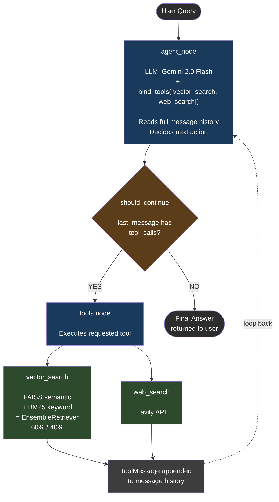

# NaviGraph — Agentic RAG System

A production-ready **Agentic RAG (Retrieval-Augmented Generation)** system built with LangGraph, FastAPI, and Streamlit. Unlike traditional RAG pipelines that follow a fixed retrieve → evaluate → generate sequence, NaviGraph uses a single autonomous agent that decides at runtime whether to search, which tool to use, how many times, and when it has enough information to answer — all driven by the ReAct reasoning loop.

---

## Why Agentic RAG — Not CRAG or Self-RAG

Traditional CRAG and Self-RAG architectures introduce separate evaluator/critic nodes that sit alongside the agent and grade retrieval quality. This creates a contradiction: if the agent already commits to a retrieval source upfront, the evaluator's judgment becomes redundant, and the system stops being truly agentic — it becomes a disguised fixed pipeline with LLM calls sprinkled in.

NaviGraph deliberately avoids this. There are no external evaluator nodes. Quality control is embedded directly in the agent's system prompt as a natural instruction. The agent itself decides whether its retrieved information is sufficient — maintaining full autonomy throughout.

---

## Graph Workflow



### How the Loop Works

1. **Entry** — User query arrives as a `HumanMessage`, appended to the conversation state
2. **Agent reasons** — The LLM reads the full message history (including system prompt, prior turns, and any tool results already collected) and decides its next action
3. **Tool call** — If the agent requests a tool, `should_continue()` routes to the `tools` node. The tool executes and its result is appended as a `ToolMessage`
4. **Loop back** — Control returns to `agent_node`. The agent now sees the tool result and reasons again — it may call another tool, call the same tool with a refined query, or decide it has enough information
5. **Final answer** — When the agent produces an `AIMessage` with no `tool_calls`, `should_continue()` routes to `END` and the answer is returned

There is no fixed number of steps. A simple greeting takes one pass. A complex research query may loop 3–4 times across both tools.

---

## Architecture

```
Rag/
├── backend/
│   ├── app/
│   │   ├── main.py                  # FastAPI app + startup pre-warming
│   │   ├── config.py                # Loads .env, exposes DATA_DIR
│   │   ├── .env                     # API keys (not committed)
│   │   │
│   │   ├── graph/
│   │   │   ├── state.py             # AgentState — messages: Annotated[..., add_messages]
│   │   │   ├── builder.py           # StateGraph assembly + SqliteSaver checkpointer
│   │   │   └── routing.py           # should_continue() — tool call vs END
│   │   │
│   │   ├── nodes/
│   │   │   └── agent.py             # agent_node — ReAct loop core
│   │   │
│   │   ├── tools/
│   │   │   ├── vector_search_tool.py
│   │   │   └── web_search_tool.py
│   │   │
│   │   ├── retrievers/
│   │   │   ├── vector_retriever.py  # HybridRetriever: FAISS + BM25 via EnsembleRetriever
│   │   │   ├── web_retriever.py     # Tavily wrapper → Document list
│   │   │   └── ingest.py            # PDF/TXT loader + chunker + index builder
│   │   │
│   │   ├── llm/
│   │   │   ├── llm_client.py        # LLMWithFallback: Gemini → Groq
│   │   │   └── prompts.py           # Agent system prompt
│   │   │
│   │   ├── memory/
│   │   │   ├── checkpointer.py      # SqliteSaver — persists graph state per thread_id
│   │   │   └── session_store.py     # SessionStore — session list, titles, timestamps
│   │   │
│   │   └── api/
│   │       ├── routes.py            # /chat, /chat/stream, /sessions, /upload
│   │       └── schemas.py           # Pydantic models
│   │
│   ├── data/
│   │   ├── vector_store/            # FAISS index files
│   │   ├── checkpoints.db           # LangGraph conversation state (SQLite)
│   │   └── sessions.db              # Session metadata (SQLite)
│   │
│   └── requirements.txt
│
├── frontend/
│   └── streamlit_app.py             # Streamlit UI
│
└── .gitignore
```

---

## Tech Stack

| Layer | Technology |
|---|---|
| Agent Orchestration | LangGraph `StateGraph` with ReAct loop |
| Primary LLM | Google Gemini 2.0 Flash |
| Fallback LLM | Groq — Llama 3.3 70B Versatile |
| Embeddings | Google `gemini-embedding-001` |
| Vector Store | FAISS (semantic search) |
| Keyword Search | BM25 (`rank-bm25`) |
| Hybrid Retrieval | LangChain `EnsembleRetriever` (60% FAISS, 40% BM25) |
| Web Search | Tavily API |
| Conversation Memory | LangGraph `SqliteSaver` checkpointer |
| Session Metadata | Custom `SessionStore` (SQLite) |
| Backend | FastAPI + Uvicorn |
| Frontend | Streamlit |
| Observability | LangSmith (project: NaviGraph) |

---

## Key Design Decisions

### Single Agent Node
The entire reasoning loop lives in one `agent_node`. The LLM is bound to both tools via `bind_tools()` and decides autonomously what to do next on every iteration. There is no planner node, no evaluator node, no critic node — just the agent and its tools.

### State = Messages Only
`AgentState` has a single field: `messages` (an accumulating list using LangGraph's `add_messages` reducer). The agent infers everything it needs — what it has already tried, what it found, whether it needs more information — directly from the message history. No manual fields like `retry_count` or `relevance_score`.

### Hybrid Retrieval
Vector search alone misses exact keyword matches. BM25 alone misses semantic similarity. The `EnsembleRetriever` combines both with weighted reciprocal rank fusion (60% semantic, 40% keyword), giving better recall across both precise and fuzzy queries.

### LLM Fallback
`LLMWithFallback` wraps Gemini as primary and Groq as fallback. If Gemini hits a rate limit or fails, the same request is automatically retried on Groq with no change to the agent logic. The UI shows a warning when fallback is triggered.

### Two Separate SQLite Databases
- `checkpoints.db` — managed entirely by LangGraph's `SqliteSaver`. Stores the full serialized graph state (all messages) per `thread_id`. Never queried directly.
- `sessions.db` — managed by `SessionStore`. Stores only session metadata (title, timestamps) for the sidebar UI. Queried independently of the checkpointer.

This separation means the session list UI never has to deserialize LangGraph's internal state format just to show a list of conversation titles.

### Streaming via SSE
The `/chat/stream` endpoint uses `graph.stream(stream_mode=["messages", "updates"])` simultaneously:
- `messages` mode → streams individual tokens to the frontend as the LLM generates them
- `updates` mode → emits node-level events (which node ran, what it produced) used to generate the live "Agent thinking..." steps in the UI

---

## API Endpoints

| Method | Endpoint | Description |
|---|---|---|
| `POST` | `/chat` | Blocking chat — returns full answer |
| `POST` | `/chat/stream` | SSE streaming — tokens + thinking steps |
| `GET` | `/sessions` | List all sessions (title, timestamps) |
| `GET` | `/sessions/{thread_id}/messages` | Load conversation history for a thread |
| `DELETE` | `/sessions/{thread_id}` | Remove a session from the list |
| `POST` | `/upload` | Upload documents and rebuild vector index |
| `GET` | `/` | Health check |

---

## Running Locally

**Prerequisites:** Python 3.11+, API keys for Gemini, Groq, and Tavily

**1. Clone and set up environment**
```powershell
cd Rag
python -m venv venv
& "venv\Scripts\Activate.ps1"
pip install -r backend/requirements.txt
```

**2. Configure API keys** — edit `backend/app/.env`:
```
GOOGLE_API_KEY=your_key
GROQ_API_KEY=your_key
TAVILY_API_KEY=your_key
LANGCHAIN_TRACING_V2=true
LANGCHAIN_API_KEY=your_langsmith_key
LANGCHAIN_PROJECT=NaviGraph
```

**3. Start backend** (from `backend/app/`):
```powershell
& "..\..\venv\Scripts\uvicorn.exe" main:app --reload --port 8000
```

**4. Start frontend** (new terminal):
```powershell
& "venv\Scripts\streamlit.exe" run frontend\streamlit_app.py
```

Open `http://localhost:8501`

---

## Uploading Documents

1. Use the **Upload Documents** section in the sidebar
2. Upload PDF, TXT, or MD files
3. Click **Ingest** — files are chunked (1000 chars, 200 overlap) and indexed into FAISS + BM25
4. Ask questions — the agent will automatically search the knowledge base when relevant

---

## LangSmith Observability

Every graph run is traced to LangSmith under project **NaviGraph**. Each conversation is grouped as a separate Thread using `metadata: {"session_id": thread_id}`. In the LangSmith UI you can see:

- Every agent loop iteration
- Which tools were called and with what queries
- Token counts and latency per node
- Whether Gemini or Groq handled each request

---

## Known Limitations

- **Ephemeral storage on hosted deployments**: `checkpoints.db`, `sessions.db`, and the FAISS index live inside the container's filesystem. On platforms like Hugging Face Spaces (free tier), a redeploy or rebuild resets these files. For production use, this would be swapped for a managed database (e.g., Supabase Postgres) to ensure persistence across restarts.
- **Free-tier rate limits**: Gemini and Groq free tiers impose request-per-minute caps. Under heavy or rapid testing, fallback to Groq may trigger more frequently.
- **No authentication**: The API currently has no auth layer — intended for local/demo use, not multi-tenant production deployment.

---

## License

This project is for portfolio and educational purposes.